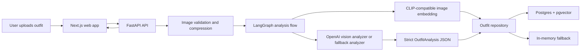

# DripJudge AI

DripJudge AI is a multimodal AI fashion analysis platform for outfit uploads, style scoring, brutally funny roasts, and useful styling recommendations

This is built as a production-style monorepo rather than a toy demo. The app has a Next.js product interface, a FastAPI backend, OpenAI vision-ready analysis, deterministic local fallback analysis, Postgres/pgvector persistence hooks, Redis infrastructure, Docker Compose, and CI checks.

## What It Does

Users upload one or more outfit photos. DripJudge AI returns:

- Detected clothing items
- Style and aesthetic classification
- A `drip_score` from 0 to 10
- A roast with selectable intensity
- Explanation of why the fit works or fails
- Strengths, issues, and fixes
- Alternate outfit recommendations
- Style history and score trends

The roast is intentionally entertaining, but the system is designed to keep criticism focused on the clothes, styling choices, colors, silhouette, accessories, and overall vibe. It avoids body-shaming and protected-class insults.

## Product Modes

The app supports four roast levels:

| Mode | Behavior |
| --- | --- |
| `chill` | Light jokes, friendly styling feedback |
| `spicy` | TikTok comment energy, sharper but not too mean |
| `brutal` | Default mode, direct and savage outfit criticism |
| `nuclear` | Maximum roast energy, still outfit-only |

Example nuclear fallback roast:

```text
Wtf is that outfit, every piece is arguing and somehow they are all losing.
```

## Tech Stack

### Frontend

- Next.js 15
- React 19
- TypeScript
- TailwindCSS
- Framer Motion
- shadcn-style component primitives
- Lucide icons

### Backend

- FastAPI
- Python 3.12
- Pydantic v2
- Async service boundaries
- Pillow image validation/compression

### AI

- OpenAI GPT-4o-compatible vision pipeline
- Structured JSON schema responses
- LangGraph orchestration boundary
- CLIP-compatible embedding service seam
- Deterministic local fallback analyzer for demos and tests

### Data and Infra

- PostgreSQL
- pgvector
- Redis
- Docker Compose
- GitHub Actions CI

## Repository Layout

```text
.
|-- apps
|   |-- api
|   |   |-- app
|   |   |   |-- api              FastAPI routes
|   |   |   |-- core             Settings and errors
|   |   |   |-- db               SQLAlchemy models/session
|   |   |   |-- schemas          Pydantic contracts
|   |   |   |-- services         AI, image, embedding, repository services
|   |   |   `-- tests            Backend tests
|   |   |-- Dockerfile
|   |   `-- requirements.txt
|   `-- web
|       |-- app                  Next.js app router
|       |-- components           Product UI and shadcn-style primitives
|       |-- lib                  API client, types, utilities
|       `-- Dockerfile
|-- infra
|   `-- postgres
|       `-- init.sql             pgvector and outfits table bootstrap
|-- docker-compose.yml
|-- package.json
|-- pyproject.toml
`-- README.md
```

## Architecture



The backend is database-first when Postgres is available. If Postgres is not running, it gracefully falls back to the in-memory history store so local demos work

## Environment

Copy the example file:

```bash
cp .env.example .env
```

Important variables:

| Variable | Purpose |
| --- | --- |
| `OPENAI_API_KEY` | Enables live OpenAI vision analysis |
| `OPENAI_MODEL` | Defaults to `gpt-4o` |
| `DATABASE_URL` | Async SQLAlchemy Postgres URL |
| `REDIS_URL` | Redis URL for cache/queue foundation |
| `NEXT_PUBLIC_API_BASE_URL` | API URL used by the web app |
| `MAX_UPLOAD_MB` | Backend upload size limit |
| `UPLOAD_STORAGE_PATH` | Reserved storage path for future object/file storage |

The app works without `OPENAI_API_KEY` by using deterministic fallback analysis. This keeps local development and CI stable.

## Local Development

### 1. Install Node dependencies

```bash
npm install
```

### 2. Create the Python environment

Use Python 3.12.

```bash
python3.12 -m venv .venv
source .venv/bin/activate
python -m pip install -r apps/api/requirements.txt
```

If `python3.12` is not available, install Python 3.12 first. The backend is intentionally pinned to Python 3.12 because some native dependencies may not support newer Python versions immediately.

### 3. Start Postgres and Redis

```bash
docker compose up postgres redis -d
```

This starts:

- Postgres on `localhost:5432`
- Redis on `localhost:6379`
- pgvector extension and `outfits` table via `infra/postgres/init.sql`

### 4. Start the API

```bash
.venv/bin/uvicorn app.main:app --app-dir apps/api --reload --host 127.0.0.1 --port 8000
```

API docs:

```text
http://127.0.0.1:8000/docs
```

### 5. Start the web app

```bash
npm run dev:web
```

Frontend:

```text
http://localhost:3000
```

## Docker Compose

To run the full stack:

```bash
docker compose up --build
```

Services:

| Service | URL |
| --- | --- |
| Web | `http://localhost:3000` |
| API | `http://localhost:8000` |
| API docs | `http://localhost:8000/docs` |
| Postgres | `localhost:5432` |
| Redis | `localhost:6379` |

Stop everything:

```bash
docker compose down
```

## API

### Health

```bash
curl http://127.0.0.1:8000/health
```

Response:

```json
{
  "status": "ok",
  "service": "dripjudge-api"
}
```

### Analyze Outfit

```bash
curl -s \
  -F files=@/path/to/outfit.jpg \
  -F user_id=demo-user \
  -F async_processing=false \
  -F roast_level=brutal \
  http://127.0.0.1:8000/api/v1/outfits/analyze
```

Valid `roast_level` values:

- `chill`
- `spicy`
- `brutal`
- `nuclear`

### List Outfit History

```bash
curl 'http://127.0.0.1:8000/api/v1/outfits/history?user_id=demo-user'
```

### Style History Summary

```bash
curl 'http://127.0.0.1:8000/api/v1/style/history?user_id=demo-user'
```

## Response Contract

The main outfit analysis contract is strict and JSON-first:

```json
{
  "style": "streetwear",
  "aesthetic": "techwear",
  "confidence": 0.91,
  "drip_score": 7.8,
  "detected_items": [
    {
      "category": "top",
      "name": "oversized hoodie",
      "color": "#111827",
      "material": "cotton fleece",
      "confidence": 0.86,
      "bbox": {
        "x": 0.12,
        "y": 0.18,
        "width": 0.56,
        "height": 0.44
      }
    }
  ],
  "issues": [
    {
      "title": "Weak silhouette anchor",
      "detail": "The proportions need one clearer hero shape.",
      "severity": 3,
      "fix": "Add a structured jacket or cleaner shoe profile."
    }
  ],
  "strengths": [
    {
      "title": "Palette control",
      "detail": "The colors are cohesive enough to build around."
    }
  ],
  "roast": "Bro what is this fit, a loading screen with shoes?",
  "explanation": "The base is workable, but the outfit needs stronger shape and styling intent.",
  "recommendations": [
    {
      "title": "Add one high-intent layer",
      "reason": "A structured outer layer gives the outfit a deliberate silhouette.",
      "priority": 5
    }
  ],
  "alternate_outfits": [
    {
      "name": "Streetwear patch",
      "items": ["boxy overshirt", "straight-leg denim", "clean sneakers"],
      "vibe": "more intentional, less default loadout"
    }
  ],
  "color_palette": ["#111827", "#f9fafb", "#7de2d1"],
  "tags": ["streetwear", "camera-ready", "roast:brutal"]
}
```

## Frontend Experience

The first screen is the actual product, not a landing page.

Current UI features:

- Drag-and-drop image upload
- File picker upload
- Camera capture
- Batch queue up to six looks
- Roast intensity segmented control
- Fit preview stage
- Drip score panel
- Color palette swatches
- Detected clothing list
- Roast card
- Fixes, wins, and upgrades
- Style history chart

## Backend Services

### `ImagePipeline`

Validates and compresses uploads:

- Rejects empty files
- Enforces max upload size
- Allows JPEG, PNG, and WebP
- Applies EXIF orientation
- Converts to optimized JPEG
- Produces a `data:image/jpeg;base64,...` preview URL
- Computes SHA-256 hash

### `VisionAnalyzer`

Handles the AI analysis:

- Uses OpenAI when `OPENAI_API_KEY` is set
- Uses a deterministic fallback analyzer when no API key is present
- Applies roast intensity instructions
- Validates model output against `OutfitAnalysis`

### `OutfitAnalysisGraph`

LangGraph-ready orchestration boundary:

1. Vision analysis
2. CLIP-compatible embedding
3. Return analysis and vector

### `ClipEmbeddingService`

Currently ships with a deterministic 512-dimensional fallback embedding. This keeps the vector storage contract stable until a full CLIP model or hosted embedding service is plugged in.

### `OutfitRepository`

Persists completed analyses:

- Writes to Postgres when available
- Stores JSON analysis and pgvector embedding
- Falls back to in-memory history when Postgres is unavailable

## Database

The bootstrap SQL creates:

- `vector` extension
- `outfits` table
- User/date index
- Vector cosine index

See:

```text
infra/postgres/init.sql
```

Core table fields:

- `id`
- `user_id`
- `image_sha256`
- `storage_url`
- `status`
- `style`
- `aesthetic`
- `confidence`
- `drip_score`
- `analysis`
- `embedding`
- `created_at`
- `updated_at`

## Testing and Quality

Backend tests:

```bash
.venv/bin/python -m pytest apps/api/app/tests
```

Backend compile check:

```bash
.venv/bin/python -m compileall apps/api/app
```

Frontend typecheck:

```bash
npm run typecheck:web
```

Frontend lint:

```bash
npm run lint:web
```

Frontend production build:

```bash
npm run build:web
```

Run the main checks:

```bash
.venv/bin/python -m pytest apps/api/app/tests
npm run typecheck:web
npm run lint:web
npm run build:web
```

## CI

GitHub Actions runs:

- Node install
- Web lint
- Web typecheck
- Web build
- Python dependency install
- Python compile check
- Backend tests

Workflow:

```text
.github/workflows/ci.yml
```

## Deployment Notes

### Frontend on Vercel

Recommended settings:

- Root: `apps/web`
- Build command: `npm run build`
- Output: Next.js default
- Env: `NEXT_PUBLIC_API_BASE_URL`

If deploying from the monorepo root, keep workspace install behavior in mind.

### Backend on Railway, Render, Fly, or AWS

Recommended command:

```bash
uvicorn app.main:app --app-dir apps/api --host 0.0.0.0 --port $PORT
```

Required env:

- `OPENAI_API_KEY`
- `OPENAI_MODEL`
- `DATABASE_URL`
- `REDIS_URL`
- `WEB_APP_URL`

### Database

Use managed Postgres with pgvector support. Run `infra/postgres/init.sql` during provisioning or migration setup.

### Redis

Redis is already included in config and Compose. It is reserved for production async processing, caching, and future worker queues.

## Safety and Roast Policy

The roast system is designed to be harsh without being abusive toward the person.

Allowed targets:

- Outfit choices
- Color coordination
- Layering
- Accessories
- Silhouette
- Styling intent
- Overall aesthetic
- Vibe

Disallowed targets:

- Body shape or size
- Race, ethnicity, nationality
- Gender or sexuality
- Religion
- Disability
- Age
- Poverty or class insults
- Sexual comments

This lets the product feel brutal and viral while staying usable as a real consumer AI product.

## Current Limitations

- Fallback item detection is heuristic, not true object detection.
- CLIP embeddings are deterministic placeholders until a real CLIP model/service is added.
- Async processing currently queues via FastAPI background tasks; Redis-backed workers are the next step.
- Local image previews are returned as data URLs. Production should use object storage such as S3, R2, or Cloudinary.
- Auth is not implemented yet; `demo-user` is used for local workflows.

## Roadmap

Near-term:

- Real object detection or segmentation for garments
- Persistent object storage for uploads
- Auth and user profiles
- Redis queue with worker process
- Better style history analytics
- Shareable roast cards

Mid-term:

- Similar-outfit search using pgvector
- Personal style memory
- Wardrobe inventory
- Shopping recommendations
- Occasion-aware styling
- Before/after outfit comparison

Long-term:

- Creator mode for TikTok-ready captions
- Brand affiliate integrations
- User style graph and trend evolution
- Fine-tuned fashion taxonomy
- Moderation telemetry for roast quality and safety

## Troubleshooting

### Port already in use

Stop existing local servers:

```bash
pkill -f "next dev"
pkill -f "uvicorn app.main:app"
```

Then restart the web and API servers.

### Next.js dev server shows stale manifest errors

This can happen if `next build` and `next dev` both touch `.next`.

```bash
pkill -f "next dev"
rm -rf apps/web/.next
npm run dev:web
```

### Python dependency install fails on a newer Python

Use Python 3.12:

```bash
python3.12 -m venv .venv
source .venv/bin/activate
python -m pip install -r apps/api/requirements.txt
```

### API works but history is empty

If Postgres is not running, the app falls back to in-memory history. Restarting the API clears that memory. Start Postgres for persistence:

```bash
docker compose up postgres redis -d
```

## License

Private project scaffold. Add a license before publishing or open sourcing.
